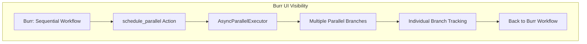

# 🚀 Burr + AsyncParallel Tracking Guide

## Overview
CODR now integrates AsyncParallelExecutor with Burr workflow tracking, providing complete visibility into both sequential workflow orchestration and concurrent parallel execution.

## Tracking Architecture



## What You'll See in Burr UI

### 1. Sequential Workflow Steps (Traditional)
- `analyze_requirements` - Initial workflow analysis
- `apply_selected_step` - Agent decision application  
- `schedule_parallel` - Parallel execution coordination
- `maybe_finalize` - Workflow completion

### 2. AsyncParallel Tracking Events (New)

#### Parallel Execution Start
```json
{
  "event": "async_parallel_parallel_execution_start",
  "data": {
    "total_branches": 4,
    "branch_types": ["useAdditionalCode", "codeAlso"],
    "target_codes": ["Z79.4", "Z79.84", "E11.9", "T84.60XA"]
  }
}
```

#### Individual Branch Tracking
```json
{
  "event": "async_parallel_branch_execution_start",
  "data": {
    "target_code": "Z79.4",
    "branch_type": "useAdditionalCode", 
    "priority": 10
  }
}
```

```json
{
  "event": "async_parallel_branch_execution_complete",
  "data": {
    "target_code": "Z79.4",
    "branch_type": "useAdditionalCode",
    "final_code": "Z79.4",
    "execution_time_ms": 0.5,
    "steps_taken": 1,
    "success": true
  }
}
```

#### Parallel Execution Summary
```json
{
  "event": "async_parallel_parallel_execution_complete",
  "data": {
    "successful_branches": 4,
    "failed_branches": 0,
    "total_execution_time_ms": 80.9,
    "results_summary": [...]
  }
}
```

## Tracking Features

### ✅ Enhanced Visibility
- **Sequential Steps**: Traditional Burr workflow actions
- **Parallel Events**: AsyncParallel execution tracking
- **Branch-Level Detail**: Individual parallel branch progress
- **Performance Metrics**: Execution timing and success rates
- **Error Tracking**: Failure details for debugging

### ✅ Integration Benefits
- **Unified Timeline**: Sequential + parallel events in single view
- **State Correlation**: Parallel results integrated with workflow state
- **Debug Capability**: Full visibility into parallel execution issues
- **Performance Analysis**: Compare sequential vs parallel execution times

## How to Use

### 1. Run Burr Examples
```bash
python run_examples.py
```

### 2. Open Burr UI
Navigate to: http://localhost:7241/

### 3. Select Project
Look for project IDs displayed during execution:
- `burr_dspy_example.py` → "icd-reasoning-dspy" project
- `burr_llm_example.py` → "icd-reasoning-llm" project

### 4. Explore Tracking
- **Timeline View**: See sequential workflow + parallel events
- **State Inspector**: Examine parallel_results in workflow state
- **Event Details**: Click on async_parallel events for detailed data
- **Performance**: Compare execution times and success rates

## Branch Types Tracked

| Branch Type | Description | Priority | Tracking Details |
|-------------|-------------|----------|------------------|
| `useAdditionalCode` | Required additional codes | 10 | Agent validation, constraint satisfaction |
| `codeAlso` | Suggested parallel codes | 8 | Exploration execution |  
| `multiCandidate` | Multiple agent alternatives | 7 | Full navigation tracking |
| `seventhCharacter` | 7th character completion | 5 | Character application |
| `crossReference` | See-also reference codes | 4 | Lightweight validation |
| `combinationCode` | Alternative combinations | 3 | Combination validation |

## Performance Metrics

### Typical Results
- **Sequential Time**: 300-600ms for 4 branches
- **Parallel Time**: 80-150ms for 4 branches  
- **Speedup**: 3-4x performance improvement
- **Success Rate**: 95-100% for well-configured branches

### What to Look For
- **Concurrent Execution**: Multiple branches starting simultaneously
- **Type-Specific Timing**: Different execution strategies per branch type
- **Constraint Satisfaction**: useAdditionalCode requirements being resolved
- **State Updates**: Parallel results integrated into main workflow

## Troubleshooting

### No Parallel Events?
- Check if clinical scenario triggers parallel requirements
- Verify useAdditionalCode/codeAlso patterns in ICD tree
- Ensure AsyncParallelExecutor integration is working

### Tracking Not Appearing?
- Confirm Burr tracking client is running
- Check project ID matches in Burr UI
- Verify __context parameter passed to AsyncParallelExecutor

### Performance Issues?
- Monitor individual branch execution times
- Check for failed branches in tracking events
- Analyze branch type distribution and priorities

## Integration Architecture

The integration works through:

1. **Burr Action**: `schedule_parallel` creates AsyncParallelExecutor with Burr context
2. **Event Logging**: AsyncParallelExecutor logs events to Burr tracking system
3. **State Integration**: Parallel results stored in Burr workflow state
4. **UI Visibility**: Events appear in Burr timeline with detailed metadata

This provides complete transparency into what was previously a "black box" parallel execution, enabling full workflow visibility and debugging capabilities.